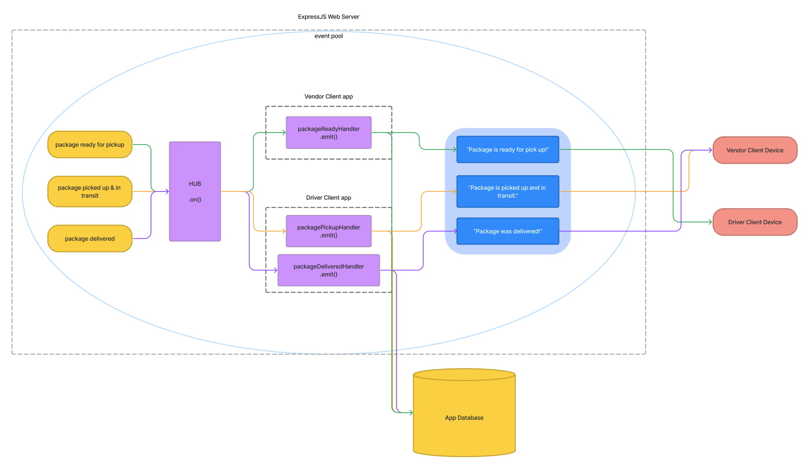

# LAB - Class 12 | Event Driven Applications

## Project: CAPS

A real-time service that allows for vendors, such as flower shops or restaurants, to alert a system of a package needing to be delivered, for drivers to instantly see what’s in their pickup queue, and then to alert the vendors as to the state of the deliveries (in transit, and then delivered).

### Authors: Heather Holcomb | 401d53

***

### Problem Domain

**CAPS Phase 1**: Using build-in Node.js events to simulate realtime package delivery changes.

Begin the build of an application for a product called CAPS - The Code Academy Parcel Service. In this sprint, we’ll build out a system that emulates a real world supply chain. CAPS will simulate a delivery service where vendors (such a flower shops) will ship products using our delivery service and when our drivers deliver them, each vendor will be notified that their customers received what they purchased.

***

### Links and Resources

- [GitHub Actions ci/cd](https://github.com/holcombheather/caps/actions)
- [back-end dev server url](https://caps-z2cc.onrender.com)
- [Whiteboard](https://www.figma.com/file/LmkZ4QxH40tRryEP8EIPrf/Whiteboard-401d53?type=whiteboard&node-id=0%3A1&t=t9QcXiax6SKKr7d3-1)

***

### Collaborators

- Referenced lecture demo for class 11 with instructor Ryan Gallaway
- Used AI to help write tests using a template I authored by referencing the tests from the lecture above and modifying it to my needs.
- Used AI to help debug issues with event sequencing to correct setInterval and setTimeout.

***

### Setup

#### How to initialize this application
1. Clone this repo into your local environment
2. `npm init -y`
3. `npm i jest chance eslint`
4. Copy Code Fellows config files `cp -r ../seattle-code-javascript-401d53/configs/ .`

#### `.env` requirements

- `PORT` - 3001  (see `.env.sample`)

#### How to run this application

- `npm start` or `nodemon`

#### Features

CAPS Phase 1: Event Driven Applications
- As a vendor, I want to alert the system when I have a package to be picked up.
- As a driver, I want to be notified when there is a package to be delivered.
- As a driver, I want to alert the system when I have picked up a package and it is in transit.
- As a driver, I want to alert the system when a package has been delivered.
- As a vendor, I want to be notified when my package has been delivered.
- As a developer, I want to use industry standards for managing the state of each package.
- As a developer, I want to create an event driven system so that I can write code that happens in response to events, in real time.

#### Tests

To run tests, use the command `npm test` in your terminal

 PASS  vendor/vendor-handler.test.js
  Vendor Handler
    ✓ emit pickup message and vendor order payload (2 ms)
    ✓ log delivered message and emit vendor thank you payload (1 ms)

 PASS  driver/driver-handler.test.js
  Driver Handler
    ✓ log pickup message and emit in-transit payload (1 ms)
    ✓ log confirmation message and emit delivered payload

#### UML

