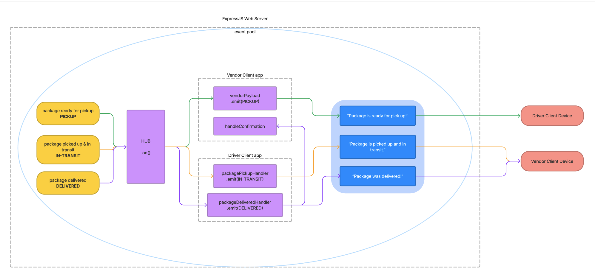

# LAB - Class 12 | Event Driven Applications

## Project: CAPS

A real-time service that allows for vendors, such as flower shops or restaurants, to alert a system of a package needing to be delivered, for drivers to instantly see what’s in their pickup queue, and then to alert the vendors as to the state of the deliveries (in transit, and then delivered).

### Authors: Heather Holcomb | 401d53

***

### Problem Domain

**CAPS Phase 2**: Continue working on a multi-day build of our delivery tracking system, creating an event observable over a network with Socket.io.

In this phase, we’ll be moving away from using Node Events for managing a pool of events, instead refactoring to using the Socket.io libraries. This allows communication between Server and Client applications.

The intent here is to build the data services that would drive a suite of applications where we can see pickups and deliveries in real-time.

***

### Links and Resources

- [GitHub Actions ci/cd](https://github.com/holcombheather/caps/actions)
- [back-end dev server url](https://caps-z2cc.onrender.com)
- [Whiteboard](https://www.figma.com/file/LmkZ4QxH40tRryEP8EIPrf/Whiteboard-401d53?type=whiteboard&node-id=0%3A1&t=t9QcXiax6SKKr7d3-1)

***

### Collaborators

- Referenced lecture demo for class 12 with instructor Ryan Gallaway
- Reference lecture code review in class 13 with instructor Ryan Gallaway
- Consulted TA Keleen for help on feature for clients joining rooms.
- Used AI to help write tests using a template I authored by referencing the tests from the lecture above and modifying it to my needs.

***

### Setup

#### How to initialize this application
1. Clone this repo into your local environment
2. `npm init -y`
3. `npm i jest chance eslin socket.io socket.io-client`
4. Copy Code Fellows config files `cp -r ../seattle-code-javascript-401d53/configs/ .`

#### `.env` requirements

- `PORT` - 3001  (see `.env.sample`)

#### How to run this application

- `npm start` or `nodemon`

#### Features

CAPS Phase 1: Event Driven Applications
- As a vendor, I want to alert the system when I have a package to be picked up.
- As a driver, I want to be notified when there is a package to be delivered.
- As a driver, I want to alert the system when I have picked up a package and it is in transit.
- As a driver, I want to alert the system when a package has been delivered.
- As a vendor, I want to be notified when my package has been delivered.
- As a developer, I want to create network event driven system using Socket.io so that I can write code that responds to events originating from both servers and client applications

#### Tests

To run tests, use the command `npm test` in your terminal

 PASS  clients/vendor/vendor-handler.test.js
  Vendor Handler
    ✓ emit pickup message and vendor order payload (3 ms)
    ✓ log delivered message and emit vendor thank you payload

 FAIL  clients/driver/driver-handler.test.js
  Driver Handler
    ✕ log pickup message and emit in-transit payload (1 ms)
    ✕ log confirmation message and emit delivered payload (1 ms)

#### UML

